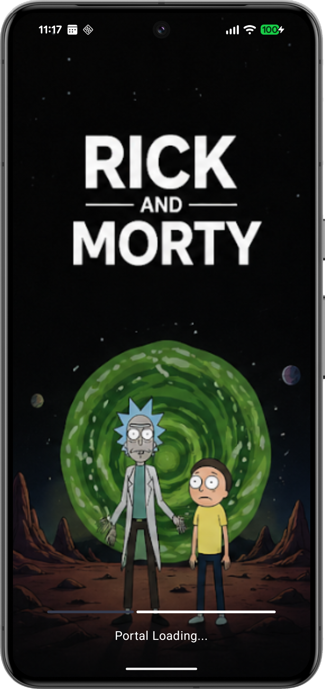
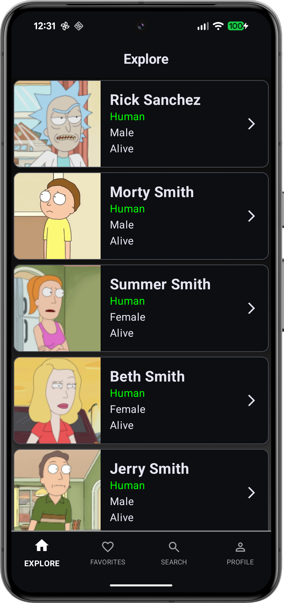
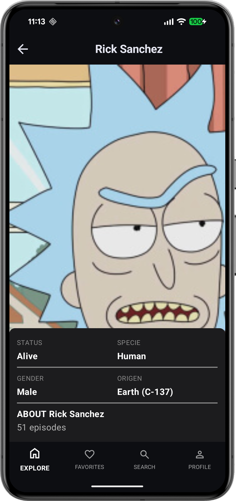
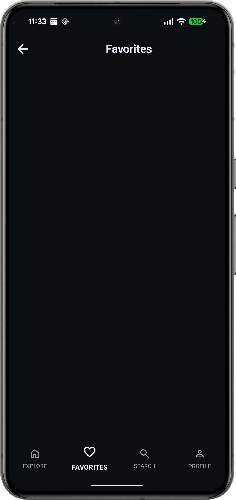
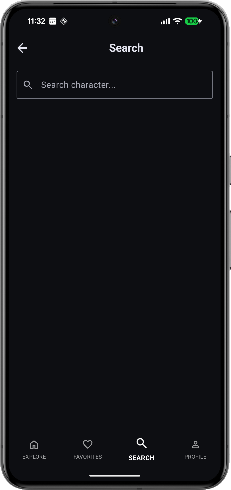
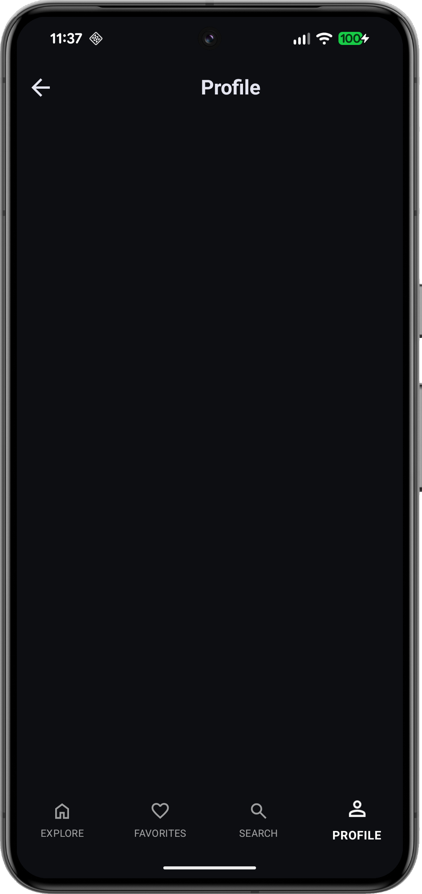
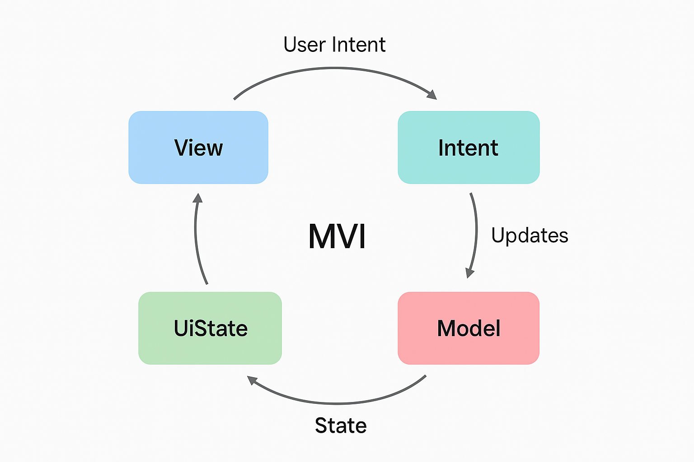

# Ricky and Morty 

## Screens
|                                  Splash                                   |
|:-------------------------------------------------------------------------:|
|  |


|                                  CharacterList                                   |                                  CharacterDetail                                   |
|:--------------------------------------------------------------------------------:|:----------------------------------------------------------------------------------:|
|  |  |

|                                  Favorites                                   |                                  Search                                   |
|:----------------------------------------------------------------------------:|:-------------------------------------------------------------------------:|
|  |  |

|                                  Profile                                   |
|:-------------------------------------------------------------------------:|
|  |

## Instalación y Configuración

Para ejecutar este proyecto localmente, sigue estos pasos:

1. **Clonar el repositorio:**
   ```bash
   git clone https://github.com/tu-usuario/RickyAndMorty.git
   ```
2. **Abrir en Android Studio:**
   Abre Android Studio (se recomienda la versión **Ladybug** o superior para compatibilidad con el Gradle utilizado). Selecciona `Open` y busca la carpeta raíz del proyecto.
3. **Sincronizar Gradle:**
   Deja que Android Studio descargue las dependencias necesarias y sincronice el proyecto automáticamente.
4. **Ejecutar la App:**
   Selecciona un emulador o un dispositivo físico y pulsa el botón **Run** (icono de play verde).

---

## Tecnologías Utilizadas

- **Jetpack Compose**: Kit de herramientas moderno para crear interfaces de usuario nativas de Android.
- **Hilt (Dagger)**: Biblioteca de inyección de dependencias para Android que reduce el código repetitivo.
- **Retrofit & Moshi**: Cliente HTTP para consumir la API de Rick and Morty y biblioteca de serialización JSON.
- **Coil**: Biblioteca de carga de imágenes moderna respaldada por corrutinas de Kotlin.
- **Paging 3**: Permite cargar y mostrar páginas de datos de un conjunto de datos más grande desde el almacenamiento local o la red.
- **Navigation 3**: Sistema de navegación moderno para Compose que facilita la transición entre pantallas.
- **Kotlin Coroutines & Flow**: Para el manejo de operaciones asíncronas y flujos de datos reactivos.

---

## Arquitectura MVI
|                               MVI                                |
|:----------------------------------------------------------------:|
|  |

MVI (Model-View-Intent) es un patrón unidireccional en el que la Vista emite Intenciones (acciones del usuario), el Presenter procesa esas intenciones y actualiza el Modelo (estado de la UI). La Vista observa el Modelo y se actualiza según los cambios de estado. Este flujo claro de datos ayuda a mantener la aplicación predecible y fácil de depurar.

---

## Cosas por Hacer (To Do)

### Pantallas y Funcionalidades
- [ ] **Pantalla de Favoritos**: Permitir a los usuarios guardar sus personajes favoritos.
- [ ] **Pantalla de Perfil**: Información detallada del usuario o estadísticas.
- [ ] **Búsqueda Avanzada**: Filtros por estado, especie, género, etc.

### Mejoras Técnicas
- [ ] **Soporte Offline con Room**: Implementar una base de datos local para que la app funcione sin conexión a internet.
- [ ] **Pruebas Unitarias y de UI**: Aumentar la cobertura de tests para asegurar la estabilidad.
- [ ] **Animaciones Avanzadas**: Mejorar la experiencia de usuario con transiciones suaves entre pantallas.
- [ ] **Modo Oscuro/Claro**: Soporte completo para temas dinámicos.
